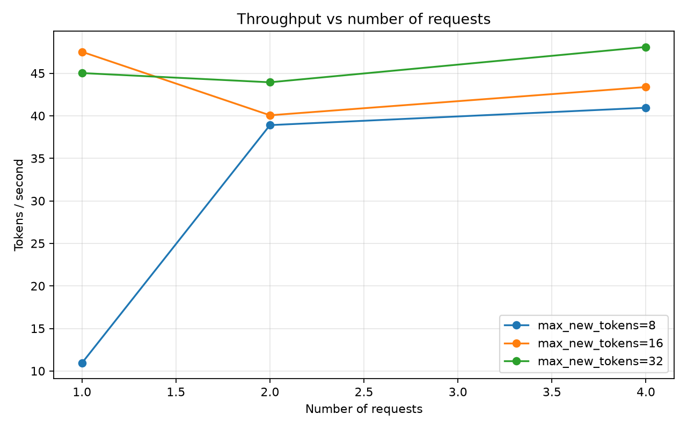
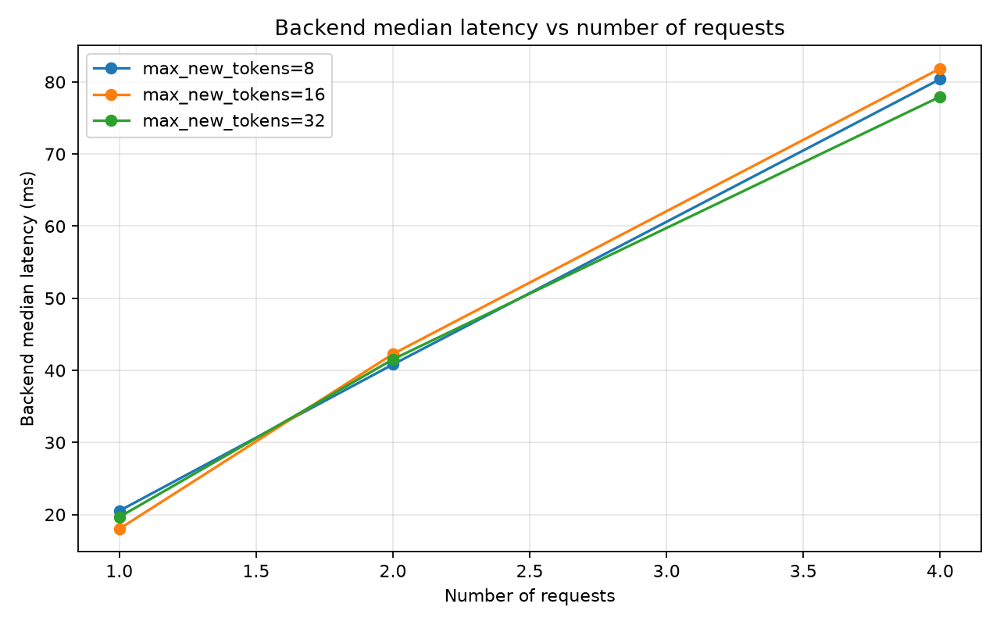
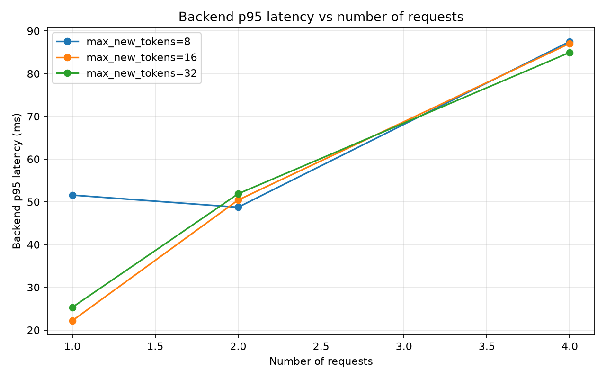
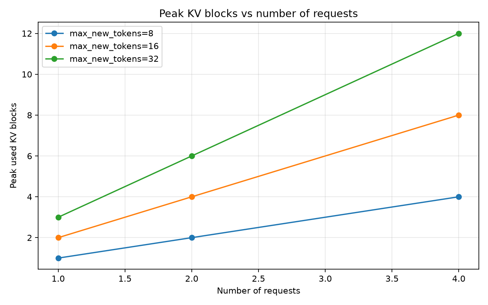

# Runtime Benchmark Report: CUDA Paged-Attention Decode

## Summary

This benchmark evaluates the current `custom-cuda-paged` inference path in the miniature LLM inference runtime. The tested path serves real TinyLlama decode requests through:

```text
EngineScheduler
  -> CustomLlamaDecodeEngine
  -> KVBlockManager
  -> KVCachePool
  -> CUDA paged-attention decode
```

The benchmark confirms that the runtime preserves correctness across different request counts and generation lengths while exposing a clear bottleneck: backend latency scales approximately linearly with active request count because the current engine loops over active requests and invokes the paged model decode path one request at a time.

## Benchmark Setup

Backend:

```text
custom-cuda-paged
```

Workload matrix:

```text
num_requests: 1, 2, 4
max_slots: same as num_requests
max_new_tokens: 8, 16, 32
block_size_tokens: 16
total_kv_blocks: 256
dtype: float16
device: cuda
prompt_set: capitals
```

The benchmark harness records:

```text
total_wall_seconds
tokens_generated
tokens_per_second
decode_iterations
decode_batches_built
backend_ms_median
backend_ms_p95
backend_ms_min
backend_ms_max
backend_ms_mean
kv_peak_used_blocks
kv_final_used_blocks
kv_final_free_blocks
correctness_passed
```

Benchmark artifacts are written to:

```text
results/benchmarks/
```

Plots are written to:

```text
results/benchmarks/plots/
```

## Generated Plots

### Throughput vs Requests



This plot shows end-to-end generated tokens per second as active request count increases.

Throughput mostly flattens around the same range once the workload is large enough. This suggests the scheduler can keep multiple requests active, but the current engine does not yet exploit fully batched model execution.

### Backend Median Latency vs Requests



Median backend latency scales nearly linearly with request count:

```text
1 request  -> roughly 18–20 ms
2 requests -> roughly 40–42 ms
4 requests -> roughly 78–82 ms
```

This is the clearest bottleneck signal. The scheduler is batching requests at the runtime level, but the engine currently loops over active requests and invokes one-request paged decode repeatedly.

### Backend P95 Latency vs Requests



The p95 latency plot shows similar scaling behavior. Tail latency increases with active request count, which is consistent with per-request decode work being serialized inside the engine.

### Peak KV Blocks vs Requests



The KV plot shows predictable block usage as request count and generation length increase.

For `block_size_tokens=16`, peak KV usage scales as expected:

```text
max_new_tokens=8:
    1 request  -> 1 block
    2 requests -> 2 blocks
    4 requests -> 4 blocks

max_new_tokens=16:
    1 request  -> 2 blocks
    2 requests -> 4 blocks
    4 requests -> 8 blocks

max_new_tokens=32:
    1 request  -> 3 blocks
    2 requests -> 6 blocks
    4 requests -> 12 blocks
```

This confirms that the KV block manager and physical KV cache pool behave predictably under concurrent serving workloads.

## Key Finding

The benchmark validates the serving path but identifies the next optimization target.

Current behavior:

```text
for each active request:
    run one-request paged model decode
```

Observed consequence:

```text
backend latency scales roughly linearly with active request count
```

Desired behavior:

```text
batch active requests into one paged model decode call
```

Expected benefit:

```text
fewer Python-level model invocations
larger batched linear operations
one batched paged-attention call per layer
better throughput scaling with active requests
```

## Correctness Result

All measured benchmark configurations passed correctness checks. The generated text prefixes matched the expected capital-city prompts, and KV blocks were reclaimed after requests completed.

This means the current runtime is correct under:

```text
single-request serving
multi-request serving
multi-token generation
paged KV allocation
KV block reclamation
CUDA paged-attention decode
```

## Current Limitation

The current CUDA paged decode path is correctness-first. Although the scheduler supports multiple active requests, the model decode path still processes each active request independently inside the engine.

This means the runtime currently demonstrates:

```text
concurrent request scheduling
paged KV isolation
CUDA paged attention correctness
```

but not yet:

```text
fully batched model decode across active requests
```

## Next Optimization Target

The next optimization is batched paged decode.

Target change:

```text
CustomLlamaDecodeEngine.decode_step
    before:
        loop over request_states
        call one-request paged model decode per request

    after:
        build a batch from active request states
        call one batched paged model decode
        update each request from the batched logits
```

This requires adding a batched model decode path:

```text
llama_model_decode_batch_with_paged_attention_from_hf_weights
```

The batched path should accept:

```text
input_ids: [batch, 1]
token_positions: [batch]
block_tables_tensor: [batch, max_blocks_per_request]
seq_lens: [batch]
block_tables: list[list[int]]
kv_cache_pool: KVCachePool
attention_backend: ReferencePagedAttentionBackend | CudaPagedAttentionBackend
```

The expected result is that each decoder layer performs batched projection, batched RoPE, batched output projection, and one batched paged-attention backend call.

## Benchmark Interpretation

This benchmark provides a useful baseline before speculative decoding or kernel optimization. The runtime is correct and measurable, and the bottleneck is now explicit.

The next benchmark should compare:

```text
custom-cuda-paged-one-request-loop
custom-cuda-paged-batched-decode
```

Expected benchmark questions:

```text
Does backend_ms_median scale better with request count?
Does backend_ms_p95 improve under 2 and 4 active requests?
Does tokens_per_second increase with active requests?
Does correctness remain unchanged?
Does KV block usage remain predictable?
```

## Conclusion

The current CUDA paged-attention runtime is correct across concurrent and multi-block serving workloads. The benchmark harness produces graphable artifacts and exposes the next systems bottleneck: active requests are scheduled concurrently, but decoded one at a time inside the engine.

The next milestone is to batch active requests through the paged model decode path.
