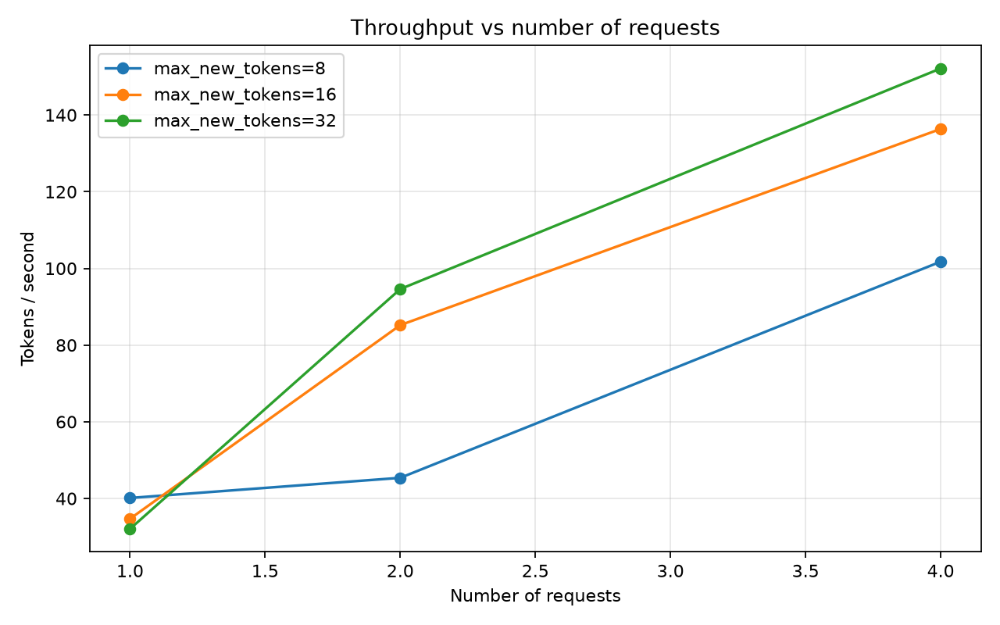
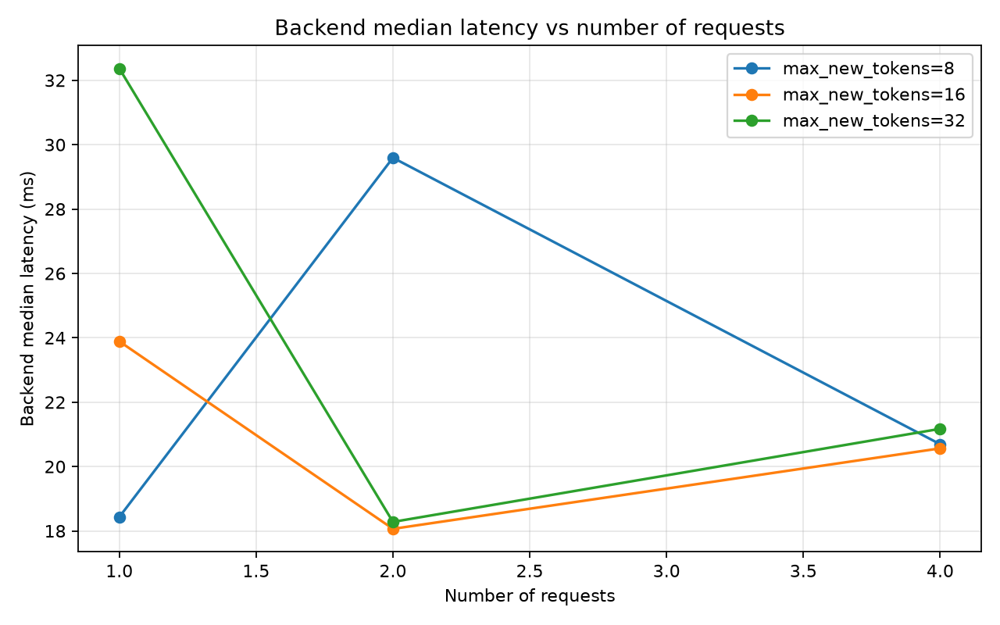
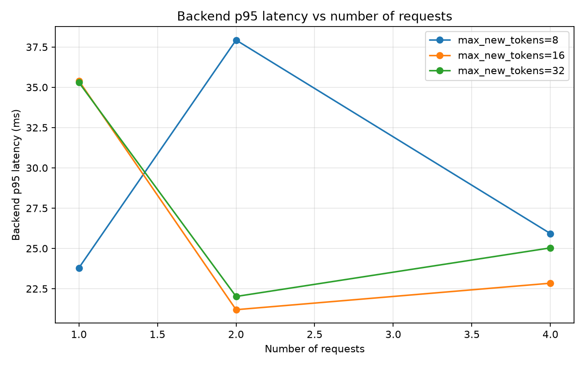

# Runtime Benchmark Report: CUDA Paged-Attention Decode

## Summary

This benchmark evaluates the `custom-cuda-paged` inference path in the miniature LLM inference runtime. The tested path serves real TinyLlama decode requests through:

```text
EngineScheduler
  -> CustomLlamaDecodeEngine
  -> KVBlockManager
  -> KVCachePool
  -> CUDA paged-attention decode
```

The benchmark validates correctness across different request counts and generation lengths, then measures the impact of batching active requests through the custom paged model decode path.

The original benchmark exposed a bottleneck: the scheduler could keep multiple requests active, but the decode engine still looped over active requests and invoked the paged model decode path one request at a time. This caused backend latency to scale approximately linearly with active request count.

The optimized path fixes that bottleneck by constructing a batched decode input from all active request states and invoking the paged model decode path once per scheduler decode step.

## Benchmark Setup

Backend:

```text
custom-cuda-paged
```

Workload matrix:

```text
num_requests: 1, 2, 4
max_slots: same as num_requests
max_new_tokens: 8, 16, 32
block_size_tokens: 16
total_kv_blocks: 256
dtype: float16
device: cuda
prompt_set: capitals
```

The benchmark harness records:

```text
total_wall_seconds
tokens_generated
tokens_per_second
decode_iterations
decode_batches_built
backend_ms_median
backend_ms_p95
backend_ms_min
backend_ms_max
backend_ms_mean
kv_peak_used_blocks
kv_final_used_blocks
kv_final_free_blocks
correctness_passed
```

Benchmark artifacts are written to:

```text
results/benchmarks/
```

Batched-decode plots are written to:

```text
results/benchmarks/plots_batched/
```

## Tested Runtime Path

The optimized decode path uses scheduler-level batching and engine-level model batching.

Current behavior:

```text
CustomLlamaDecodeEngine.decode_step
  -> collect active RequestState objects
  -> build input_ids: [batch, 1]
  -> build token_positions: [batch]
  -> build block_tables_tensor: [batch, max_blocks_per_request]
  -> build seq_lens: [batch]
  -> call one batched paged model decode
  -> update each request from its row of logits
```

The model path is:

```text
llama_model_decode_batch_with_paged_attention_from_hf_weights
  -> batched embedding
  -> batched decoder layers
  -> batched Q/K/V projection
  -> batched RoPE
  -> write current-token K/V into KVCachePool
  -> one batched paged-attention backend call per layer
  -> batched output projection
  -> final norm
  -> lm_head
```

This replaces the earlier one-request loop:

```text
for each active request:
    run one-request paged model decode
```

with:

```text
run one batched paged model decode for all active requests
```

## Generated Plots

### Throughput vs Requests



This plot shows end-to-end generated tokens per second as active request count increases.

After batched decode, throughput scales much better with request count. The system is now able to exploit concurrent active requests instead of serializing each request inside the decode engine.

Representative observed behavior:

```text
1 request:  roughly 30–50 tokens/second
2 requests: roughly 45–95 tokens/second
4 requests: roughly 100–150 tokens/second
```

The exact values vary by generation length and run-to-run noise, but the trend is clear: throughput increases materially under concurrency.

### Backend Median Latency vs Requests



Before batched decode, backend median latency scaled approximately linearly with request count:

```text
1 request  -> roughly 18–20 ms
2 requests -> roughly 40–42 ms
4 requests -> roughly 78–82 ms
```

After batched decode, the 2-request and 4-request cases no longer pay a full one-request decode cost per active request. Backend latency is noisier across small benchmark runs, but the previous linear scaling bottleneck is removed.

Representative post-optimization behavior:

```text
1 request  -> roughly 18–32 ms
2 requests -> roughly 18–30 ms
4 requests -> roughly 21–30 ms for shorter decode workloads
```

The 4-request, 32-token case can still show higher latency due to longer decode runs and run-to-run variance, but it remains far below the previous one-request-loop behavior.

### Backend P95 Latency vs Requests



The p95 latency plot shows tail behavior after batching.

The important result is that tail latency no longer reflects strict per-request serialization inside the engine. The engine now performs one batched paged decode per scheduler step, which reduces the latency penalty of serving multiple active requests.

Some noise remains because the benchmark is small, the model path is still Python-heavy, and the runtime is correctness-first rather than fully production-optimized.

### Peak KV Blocks vs Requests


The KV plot shows predictable block usage as request count and generation length increase.

For `block_size_tokens=16`, peak KV usage scales as expected:

```text
max_new_tokens=8:
    1 request  -> 1 block
    2 requests -> 2 blocks
    4 requests -> 4 blocks

max_new_tokens=16:
    1 request  -> 2 blocks
    2 requests -> 4 blocks
    4 requests -> 8 blocks

max_new_tokens=32:
    1 request  -> 3 blocks
    2 requests -> 6 blocks
    4 requests -> 12 blocks
```

This confirms that the optimization changed compute batching without changing KV allocation semantics. The KV block manager and physical KV cache pool still behave predictably under concurrent serving workloads.

## Before vs After

The original benchmark showed that scheduler-level batching alone was insufficient.

Before batched decode:

```text
Scheduler admitted multiple active requests.
Engine looped over active requests.
Each request invoked a separate paged model decode.
Backend latency scaled roughly linearly with request count.
Throughput flattened under concurrency.
```

After batched decode:

```text
Scheduler admits multiple active requests.
Engine builds one batched decode input.
All active requests share one paged model decode call.
Each decoder layer uses batched projections and one batched paged-attention call.
Throughput improves materially as request count increases.
KV block usage remains unchanged and predictable.
```

Representative improvement:

```text
before:
    4 active requests -> roughly 78–82 ms backend median

after:
    4 active requests -> roughly 21–30 ms backend median for shorter decode workloads
```

Representative throughput change:

```text
before:
    4 active requests -> roughly 40–48 tokens/second

after:
    4 active requests -> roughly 100–150 tokens/second depending on generation length
```

## Correctness Result

All measured benchmark configurations passed correctness checks. The generated text prefixes matched the expected capital-city prompts, and KV blocks were reclaimed after requests completed.

The optimized runtime is correct under:

```text
single-request serving
multi-request serving
multi-token generation
paged KV allocation
multi-block KV allocation
KV block reclamation
CUDA paged-attention decode
batched model decode across active requests
```

The scheduler tests also validate that the engine reports the optimized backend path:

```text
custom-llama-cuda-paged-attention-batched
```

and that decode batch snapshots include:

```text
batched_decode: True
```

## Key Finding

The main bottleneck was not the scheduler or KV block manager. The bottleneck was the engine boundary.

The scheduler already knew how to batch active requests:

```text
active requests -> decode batch
```

But the old engine implementation destroyed that batching:

```text
decode batch -> loop over requests -> one model decode per request
```

The optimized engine preserves the batch:

```text
decode batch -> one batched paged model decode
```

This is the main systems lesson from the benchmark: request scheduling and model execution must both preserve batching. A scheduler can expose concurrency, but the engine must consume that concurrency efficiently.

## Remaining Limitations

The current runtime is still correctness-first and educational. It is not yet a production inference server.

Current limitations include:

```text
Python-heavy model orchestration
no fused MLP kernels
no fused RMSNorm kernels in the runtime path
limited CUDA kernel specialization
small benchmark matrix
small model only
no prefill batching
no speculative decoding
no production-grade admission control
```

The current CUDA paged-attention kernel handles the decode attention path, but much of the surrounding transformer layer still runs through PyTorch operations.

## Next Optimization Targets

The next optimization targets are:

```text
1. Add a before/after benchmark report table
2. Add larger request-count sweeps
3. Add block-size sensitivity benchmarks
4. Add prefill batching
5. Add fused RMSNorm and MLP kernels
6. Add speculative decoding as a higher-level serving optimization
7. Add CI markers separating CPU, CUDA, slow, and benchmark tests
```

The most natural next technical milestone is block-size sensitivity:

```text
block_size_tokens: 4, 8, 16, 32
```

Expected questions:

```text
How does block size affect KV fragmentation?
How does block size affect attention gather overhead?
How does block size affect peak block pressure?
How does block size affect throughput under concurrency?
```

## Benchmark Interpretation

This benchmark establishes a useful baseline for future serving optimizations.

The runtime now demonstrates:

```text
concurrent request scheduling
paged KV isolation
physical KV cache pool writes
CUDA paged attention correctness
batched decode across active requests
KV block reclamation
benchmarkable throughput and latency metrics
```

The most important result is that the benchmark drove the optimization. The first measurement exposed a specific architectural flaw. The code was then changed to preserve batching across the engine boundary. The second measurement confirmed the improvement.

That is the intended development loop for this project:

```text
build correctness-first path
measure it
identify bottleneck
patch the architecture
rerun correctness tests
rerun benchmark
document the result
```

## Conclusion

The CUDA paged-attention runtime is now correct across concurrent, multi-token, and multi-block serving workloads. The benchmark harness produces graphable artifacts and exposed a real systems bottleneck: active requests were scheduled concurrently but decoded one at a time inside the engine.

That bottleneck has now been addressed. The optimized engine batches active requests into a single paged model decode call, improving throughput under concurrency while preserving KV cache correctness and predictable allocation behavior.

The project has moved from a correctness-only CUDA paged-attention serving path to a measured, optimized, batched decode path with a clear benchmark-backed performance story.
